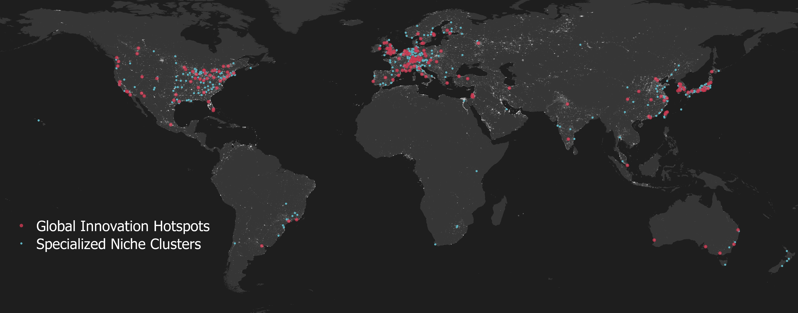

# Data & Code

## Code

- **[Global innovative trend of methane abatement technologies and widening mismatch with methane emissions](https://github.com/DeyunYinWIPO/global_methane), Nature Climate Change**, by Jingjing JIANG, **Deyun YIN**, Zhuoluo SUN, Bin YE, Nan ZHOU (2024)
- **[Measuring Risk in Science](https://github.com/DeyunYinWIPO/science_risk). Journal of Informetrics**, by **Deyun YIN**, Zhao WU, Sotaro SHIBAYAMA (2023)
  - Measure and predict risk of scientific ideas/projects with scientific text data 

- **[Identify Novel Elements of Knowledge with Word Embedding](https://github.com/DeyunYinWIPO/Novelty_science_text). PLOS ONE**. by **Deyun YIN**, Zhao WU, Kazuki YOKOTA, Kuniko MATSUMOTO, Sotaro SHIBAYAMA (2023), 18(6). 
  - Measuring novelty in science with text similarity of focal document with all its previous documents

- **[Measuring novelty in science with word embedding](https://github.com/DeyunYinWIPO/Novelty). PLOS ONE**, by Sotaro SHIBAYAMA, **Deyun YIN**, Kuniko MATSUMOTO (2021). 
- [Genderit](https://github.com/IES-platform/r4r_gender): code for identifying gender based on global name dictionary WIPO's [World Gender-Name Dictionary (WGND)](https://github.com/IES-platform/r4r_gender/blob/main/wgnd/README.md): a worldwide gender-name dictionary which identifies gender for **25+ million names in 195 countries or territories**, by Gema Lax MARTÍNEZ , Helena Saenz de JUANO-I-RIBES , **Deyun YIN**, Bruno Le FEUVRE, Intan Hamdan-Livramento, Kaori Saito and Julio Raffo (2021) 

## Databases

### Global Patent Databases

- **Global Patent Database**
  - **Expanded PATSTAT Global Patent Database** (1970-2019, data after 2019 forthcoming)
    - A complete version of PATSTAT with missing information imputed with original data from patent offices such as CNIPA, WIPO, JPO, and USPTO.
    - Patent family level pre-computed indicators
  - [**World Global Name Dictionary (WGND 2.0)**](https://github.com/IES-platform/r4r_gender) : A global name-gender dictionary for inventors.
- **Patent Databases by Jurisdiction**
  - **Full-Sample CNIPA Chinese Patent Database**
    - CNIPA Patent Applicant's Geocoded Address Database (1985-2024): For data construction process, please see Yin et al., 2020
    - CNIPA  Patent City-District Database
    - CNIPA Patent Inventor Name Disambiguation Database
    - CNIPA Mobile Inventor Database
    - CNIPA Patent Quality Database
  - **Enhanced Japanese JPO Patent Office Database**

### Academic Paper Databases

- **WOS Paper Database**
  - **WOS Geocoding Database**
  - **WOS Paper Word Embedding Model Database**
  - **WOS Paper Indicator Database**, including key indicators such as:
    - **Novelty**: Innovation level of the paper.
    - **Impact**: Influence and reach of the paper.
    - **Risk**: R&D risks associated with the paper and projects.
    - **Others**: (to be released)

## Visualizations 

### Identifying global innovation clusters 

**Where are global innovation clusters?** 

For details, please see WIPO (2019), [World Intellectual Property Report 2019](https://www.wipo.int/en/web/world-ip-report/2019/index). 

### Mapping global innovation Networks 

What does global innovation network looks like? Details in WIPO (2019), [World Intellectual Property Report 2019](https://www.wipo.int/en/web/world-ip-report/2019/index). 

Top10% co-invention ties among GINs and SNCs, 2011-2015

### Mapping & comparing regional innovation networks 

## Access and Collaboration

For access to database resources or collaboration inquiries, please contact via email: **yindeyunut@gmail.com**
