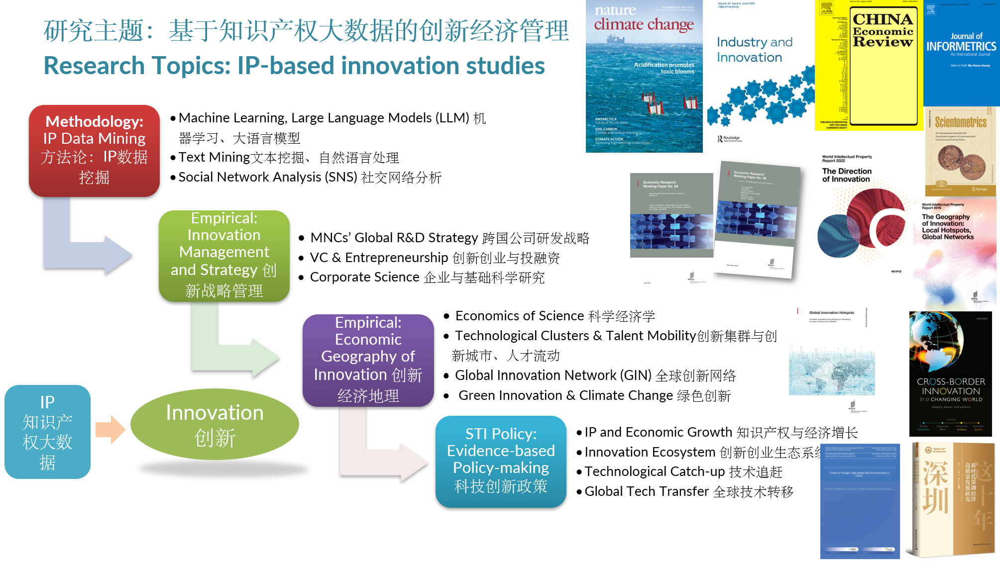

## Deyun Yin

### Short Bio

Dr. Yin Deyun an associate professor in innovation economics and intellectual property (IP) data mining at Harbin Institute of Technology, Shenzhen (HITSZ). She graduated from **the University of Tokyo** at March, 2019. After graduation, she has been working as a research fellow for the **World Intellectual Property Organization (WIPO)**, a specialized agency of the United Nations. Dr. Yin also has rich research and working experience in government-affiliated research organizations such as Research Institute of Economy, Trade, and Industry (RIETI) as well as National Institute of Science and Technology Policy (NISTEP). Now she serves as a senior guest fellow at the University of Tokyo. Some of her papers have been published on international journals such as **Nature Climate Change, Indsutry and Innovation, China Economic Review, Journal of Informetrics, Scientometrics** etc. When working as a fellow WIPO, she also contributed to the release of the **World Intellectual Property Report (WIPR) 2019, WIPR 2022** and led one **WIPO development study – Innovation ecosystem and catch-up in developing countries: Evidence from Shenzhen**.

She has been recognized as an **Overseas High-Caliber Talent of Shenzhen** and a Pilot Talent of Nanshan District, and advises government bodies including the China National Intellectual Property Administration (CNIPA), the Guangdong Administration for Market Regulation, the Shenzhen IP Office, and the Shenzhen Science, Technology and Innovation Commission. Her teaching spans **Technology Management of Innovation (MBA; 98.68% evaluation score), Innovation Economics and Management (A, A+), IP Management Strategy, Technology Transfer (MBA), Strategic Management, and From OpenClaw to Hermes: AI Agents and Their Commercial Applications.** She has also repeatedly delivered specialized training to government leaders at the provincial and municipal levels across China, covering AI Agent applications, IP big data analytics, innovation economics, management, and policy.

Dr. Yin serves on the editorial board of **Humanities and Social Sciences Communications** and reviews for **Research Policy, Regional Studies, and China Economic Review**. She is the Committee Member of both the **Intellectual Property Policy and Management Professional Committee** in Chinese Society for Science and Technology Policy and **Committee of Technology Incubation and Innovation Ecosystem** in Chinese Society of Technology Economics. She has been an invited speaker at the National Bureau of Economic Research (NBER), the U.S. Patent and Trademark Office (USPTO), EPFL, Hitotsubashi University, etc. A trained **data scientist**, she works fluently in Python, R, Stata, SQL, DuckDB, and Tableau.

### Research Interests 

- **IP Analytics and Management Strategy**: 
    - studying innovation with large-scale intellectual property data, especially the application of artificial intelligence, machine learning, LLMs, AI Agents, social network analysis(SNA), green and climate change patent analysis. 
    - corporate IP Management strategies 
- **Innovation Economics & Management**: Economic geography, innovation clusters, global innovation network,  inventor mobility in China and the world, technology transfer.
- **Science, technology, and innovation (STI) policy**: IP and growth, regional innovation ecosystem, technological catch-up  
- **AI Agents and Intelligent Economics**: Academic and commercial applications of AI agents, OPC Building, corporate AI transformations and upgrading, token economics, etc. 

## Working & Education Background

### Working Experiences

|      Year       |                         Institution                          |      Position       |
| :-------------: | :----------------------------------------------------------: | :-----------------: |
|    2023.12~     | Harbin Institute of Technology, Shenzhen (HITSZ), School of Economics and Management | Associate Professor |
| 2020.01~2023.12 | Harbin Institute of Technology, Shenzhen (HITSZ), School of Economics and Management | Assistant Professor |
|    2024.04~     | University of Tokyo, Research Center for Advanced Science and Technology | Senior Guest Fellow |
|    2021.03~2021.09 |       World Intellectual Property Organization (WIPO)        |     Consultant      |
| 2019.02~2021.02 |       World Intellectual Property Organization (WIPO)        |   Research Fellow   |
| 2017.05~2019.02 |  Research Institute of Economy, Trade and Industry (RIETI)   | Research Assistant  |

### Education Background

|      Date       |                   Academic Degree                    |     University      |
| :-------------: | :--------------------------------------------------: | :-----------------: |
| 2016.04~2019.03 | **Ph.D.** Technology Management for Innovation (TMI) | University of Tokyo |
| 2011.09~2014.06 |   **M.A.** History and Philosophy of Science (HPS)   |  Peking University  |
| 2005.09~2010.07 |                 **B.A.** Philosophy                  |  Wuhan University   |

## Public Services

### Academic services

|   Time   |                             Role                             |
| :------: | :----------------------------------------------------------: |
| 2018.11~ | Referee for *Research Policy, TSFC, Scientometric*s, *Regional Studies,* *AOM Annual Conference*, etc. |
| 2021.11  | Chair of the Intellectual Property Subforum  at the 2021 China Management Annual Conference. |
| 2020.01~ | Co-organizer of GEOINNO 2020’s special session:  Big data, machine learning and the challenge of the geography of innovation |
| 2019.12~ | Founding Member of the Expert Panel for the NBER Innovation Information Initiative |

### Consulting services

|   Time   |                             Role                             |
| :------: | :----------------------------------------------------------: |
| 2024.02~ | Expert for the "World Bank Global Business Environment and Intellectual Property" Project, China National Intellectual Property Administration (CNIPA) |
| 2023.08~ | Expert for the Guangdong Provincial Administration  for Market Regulation (Intellectual Property Office) |
| 2022.05~ | Intellectual Property Expert for Shenzhen and Project Review Expert  for the Shenzhen Science and Technology Innovation Commission |
| 2021.07~ | Overseas Rights Assistance Expert  for the China (Shenzhen) Intellectual Property Protection Center |

