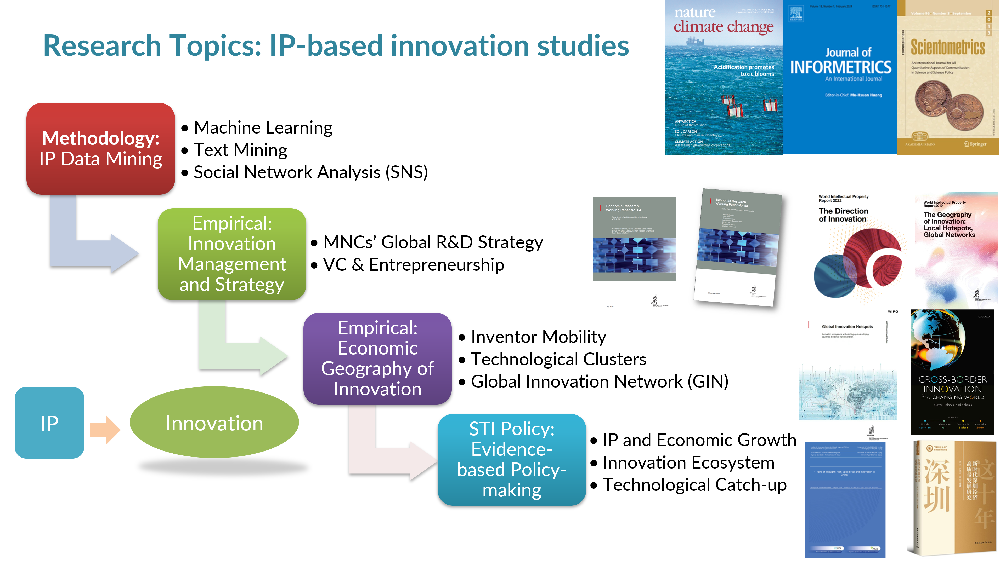

## Deyun Yin

- Associate Professor 
- School of Economics and Management, Harbin Institute of Technology, Shenzhen (HITSZ)
- Keywords: IP Data Mining, Innovation Economics and Management, STI Policy

### Short Bio

Dr. Yin Deyun an associate professor in innovation economics and intellectual property (IP) data mining at Harbin Institute of Technology, Shenzhen (HITSZ). She graduated from **the University of Tokyo** at March, 2019. After graduation, she has been working as a research fellow for the **World Intellectual Property Organization (WIPO)**, a specialized agency of the United Nations. Dr. Yin also has rich research and working experience in government-affiliated research organizations such as Research Institute of Economy, Trade, and Industry (RIETI) as well as National Institute of Science and Technology Policy (NISTEP). Now she serves as a senior guest fellow at the University of Tokyo. Some of her papers have been published on international journals such as **Nature Climate Change, Journal of Informetrics, Scientometrics** etc. When working as a fellow WIPO, she also contributed to the release of the **World Intellectual Property Report (WIPR) 2019, WIPR 2022** and led one **WIPO development study – Innovation ecosystem and catch-up in developing countries: Evidence from Shenzhen**.

### Research Interests 

- **IP Data Mining**: studying innovation with large-scale intellectual property data, especially the application of artificial intelligence, machine learning, social network analysis, green and climate change patent analysis.
- **Innovation Economics & Management**: Economic geography, innovation clusters, global innovation network,  inventor mobility in China and the world, technology transfer.
- **Science, technology, and innovation (STI) policy**: IP and growth, regional innovation ecosystem, technological catch-up  

## Working & Education Background

### Working Experiences

|      Year       |                         Institution                          |      Position       |
| :-------------: | :----------------------------------------------------------: | :-----------------: |
|    2023.12~     | Harbin Institute of Technology, Shenzhen (HITSZ), School of Economics and Management | Associate Professor |
| 2020.01~2023.12 | Harbin Institute of Technology, Shenzhen (HITSZ), School of Economics and Management | Assistant Professor |
|    2024.04~     | University of Tokyo, Research Center for Advanced Science and Technology | Senior Guest Fellow |
|    2021.03~     |       World Intellectual Property Organization (WIPO)        |     Consultant      |
| 2019.02~2021.02 |       World Intellectual Property Organization (WIPO)        |   Research Fellow   |
| 2017.05~2019.02 |  Research Institute of Economy, Trade and Industry (RIETI)   | Research Assistant  |

### Education Background

|      Date       |                   Academic Degree                    |     University      |
| :-------------: | :--------------------------------------------------: | :-----------------: |
| 2016.04~2019.03 | **Ph.D.** Technology Management for Innovation (TMI) | University of Tokyo |
| 2011.09~2014.06 |   **M.A.** History and Philosophy of Science (HPS)   |  Peking University  |
| 2005.09~2010.07 |                 **B.A.** Philosophy                  |  Wuhan University   |

## Public Services

### Academic services

|   Time   |                             Role                             |
| :------: | :----------------------------------------------------------: |
| 2018.11~ | Referee for *Research Policy, TSFC, Scientometric*s, *Regional Studies,* *AOM Annual Conference*, etc. |
| 2021.11  | Chair of the Intellectual Property Subforum  at the 2021 China Management Annual Conference. |
| 2020.01~ | Co-organizer of GEOINNO 2020’s special session:  Big data, machine learning and the challenge of the geography of innovation |
| 2019.12~ | Founding Member of the Expert Panel for the NBER Innovation Information Initiative |

### Consulting services

|   Time   |                             Role                             |
| :------: | :----------------------------------------------------------: |
| 2024.02~ | Expert for the "World Bank Global Business Environment and Intellectual Property" Project, China National Intellectual Property Administration (CNIPA) |
| 2023.08~ | Expert for the Guangdong Provincial Administration  for Market Regulation (Intellectual Property Office) |
| 2022.05~ | Intellectual Property Expert for Shenzhen and Project Review Expert  for the Shenzhen Science and Technology Innovation Commission |
| 2021.07~ | Overseas Rights Assistance Expert  for the China (Shenzhen) Intellectual Property Protection Center |

